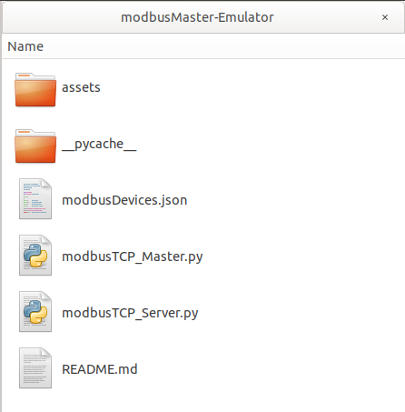
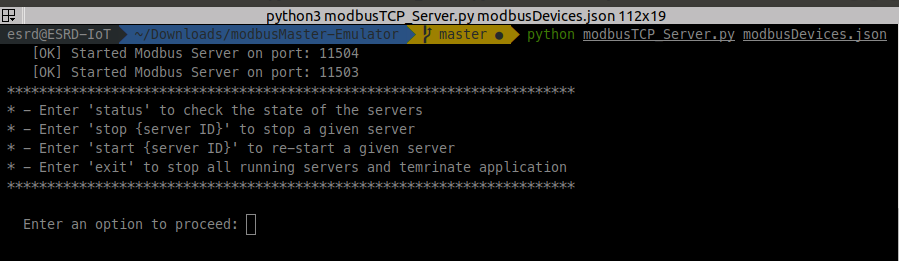
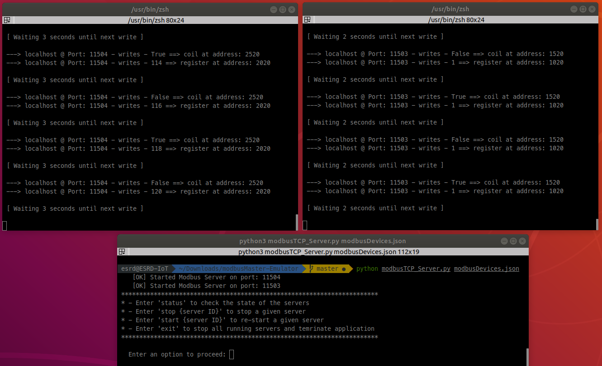
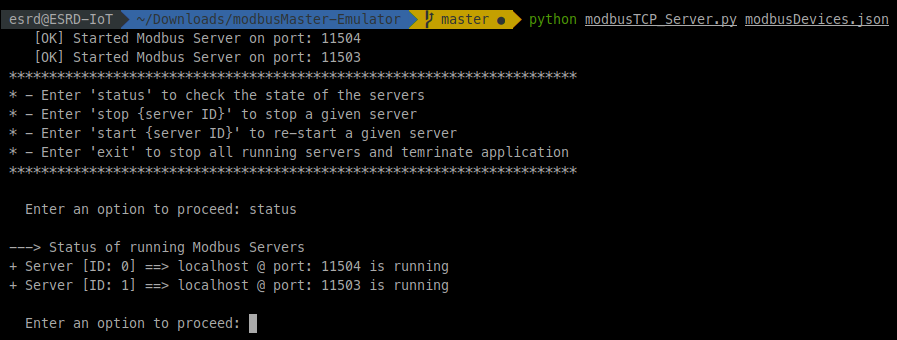
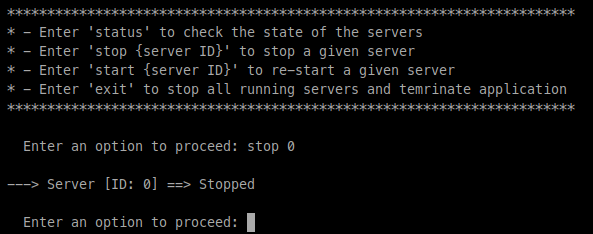
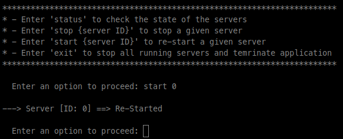
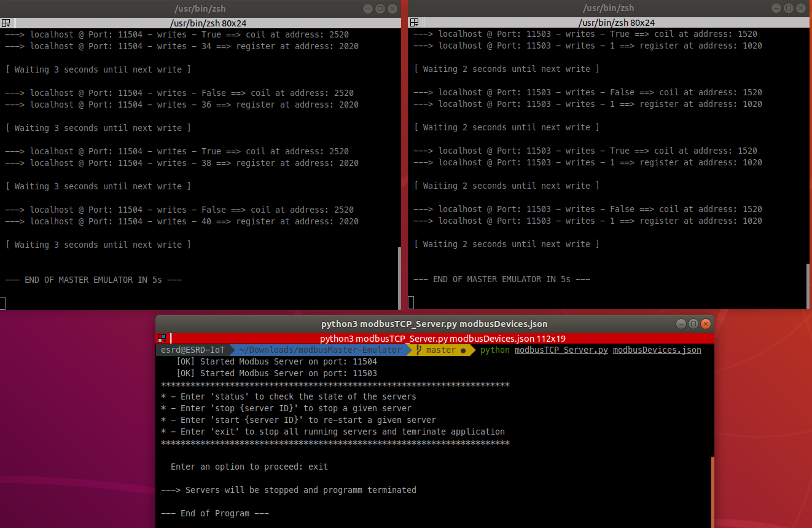
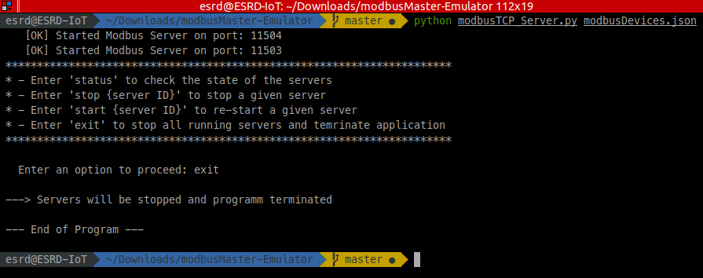

 
 

# Modbus Master Device - Emulator

Python solution to emulate a Modbus Master device that produces data as if it were connected to a real system that produces data to be consumed by another devices.

DIAGRAM

## Setting everything up

Since we will be working with Python, we shall set up the environment accordingly.

Depending on the system you are working on (Ubuntu or MacOS) check in the corresponding article the chapter about how to set up Python 3.

* LINK To HOW TO in UBUNTU
* LINK To HOW TO in MAC OS

Once we have set up the Python environment in our computer, we can clone the project and finish setting up the development environment.

Go to the folder you want to clone the project in and clone the project

	git clone https://github.com/fcomir-io/modbusMaster-Emulator.git
	

The project structure would look like this

**Note:** *assets* folder contains all images needed for this Read Me; it is not relevant for the script!

### Install pyModbusTCP library

Since the script is based on a library that requires v3.5.x, we shall set the local python version using pyenv (previously installed).

	cd /modbusMaster-Emulator
	pyenv local 3.5.9
	
You should see something like this:
	
	3.5.9 (set by {...}/modbusMaster-Emulator/.python-version)

Once the needed python version was set, install **pyModbusTCP **library

	pip install pyModbusTCP

## Executing the script

Basically the script needs a json-file (passed as argument) to parse the information of the device(s) to be emulated. 
The argument passed could be 
- just the name of the file. In this case, the  script would look for it in the same path of the script.
- a complete path of the file (starting with '/'). In this case, the script would use the path directly to open the json-File.

As example the project already has a json-File [json-File Example](modbusDevices.json).
The file is an array of device-Objects that represent the devices that shall be emulated.

A Device-Object consists on 
- Host
- Port
- Data Array (Coils and Registers)
- Waiting Time

**Note:** More information about the json-File later on this Read Me!

To start the script run the **modbusTCP_Server.py** script giving the json-File as argument

	python modbusTCP_Server.py modbusDevices.json

This will start the script creating two Modbus Servers running on ports 11504 and 11503.

 

Two new terminal windows will be opened: one for each Modbus Device. In each window one can see how the device is writing data to the coil/register defined in the json-File.

 

### Script Menu

The script offers 4 options

* Get Status of the Devices ==> By entering *status* the script will give information about the devices

 

* Stop a running device ==> By entering *stop* and the specific device ID the script will stop the device and close the corresponding terminal window. The master device will no longer be writing data into the bus!

 

* Start a stopped device ==> By entering *start* and the specific device ID the script will start (or re-start if the device is already running) the device and re-open a terminal window. The master device will continue writing data into the bus again!

 

* Terminate the script ==> By entering *exit* the script will stop the devices and close the corresponding terminal windows and finish the execution!

 

 

## Testing the solution

Once the Server side was started, go to testScript folder and run testScript.py to poll data from the emulated devices

	python testScript.py modebusDeviceList.json
	
TODO ==> Images of Testscript execution

## More Info... How does the script work?

In a Modbus configuration, the Server is the device generating data to be consumed by the other devices (aka. Slaves).

In a real solution, the Server would be all **IoT Modules** connected to the DataSource that would be sending Data into the Modbus-Channel. On the other side, a device would be listening to the bus and would consume this data for further processing.

DIAGRAM

In order to create an abstracted solution without having an IoT Modul and the corresponding Data Source attached, an Emulator would be needed in order to produce real data to work with. This way the next stages of the solution (Data Consolidation, Storage and Visualization) can be implemented independent of the Data Source.

The Server Emulator consists of two Python scripts and a json file

* **modbusTCP_Server.py**

It creates Modbus devices running on the localhost through a given TCP-Port.

* **modbusTCP_Master.py**

It rpdouces data by writing coils and/or registers on given addresses.

* **modbusDevices.json**

It defines the devices that shall be emulated and thus the TCP-port and coils/registers addresses that shall be used.

### Server

DIAGRAM

The Emulator is started by calling Server-File with the name of the json-File where the Devices are described.

	python modbusTCP_Server.py modbusDevices.json 

The json-file is expected to be in the same folder as the python file

Once the python script starts and extract the file name from the arguments, the following actions are performed

1- Check json-File

The integrity of the file is checked in order to have a correct json-file to work with.

	def CheckModbusDeviceListFile(jsonFileName):
	    # Check if file exists    
	    fileToCheck = Path(os.getcwd() + "/" + jsonFileName)    
	    if fileToCheck.is_file():
		# Check if file is JSON ok
		try:
		    # Since we re working with python v3.5, open needs a string as argument
		    json_object = json.loads(open(str(fileToCheck)).read())
		except Exception as e:
		    return [2, ""]
		return [0, json_object]    
	    else:
		return [1, ""]
		
Possible responses of the function:

	### modbusDevicesList is an array of two values:
	#   - Positon 0 ==> Error code. 
	#     * '0' ==> No error
	#     * '1' ==> File not found
	#     * '2' ==> Not JSON format
	#   - Positon 1 ==> JSON data with Modbus Devices List or empty string if there was an error
	############################################################################################

If the file is correct ==> Error Code = 0, a Modbus Server will be created for each device of the list extracted from the json-File. Each server means a *thread* running in background.

	def SetupModbusServerDevice(device):
	    
	    global arrayOfModbusServers
	    global modbusDeviceList_Counter

	    # Extracting information from device object
	    deviceHost = device["host"]
	    devicePort = device["port"]
	    deviceData = device["data"]

	    # parse args
	    parser = argparse.ArgumentParser()
	    # --- Identify argument already defined by user
	    parser.add_argument('file')
	    # --- Include arguments needed by ModbusServer
	    parser.add_argument('-H', '--host', type=str, default=deviceHost, help='Host')
	    parser.add_argument('-p', '--port', type=int, default=devicePort, help='TCP port')    
	    args = parser.parse_args()
	    # Start modbus server    
	    try:
		# Create Modbus Server        
		server = ModbusServer(host=args.host, port=args.port, no_block=True)     
		# Start Modbus Server
		server.start()
		# If everything ok, create an object ID for the server and append it into array        
		temp = {
		    "id" : modbusDeviceList_Counter,
		    "host" : str(deviceHost),
		    "port" :  str(devicePort),
		    "data" : deviceData,
		    "waitingTime" :  device["waitingTime"],
		    "object" : server
		}
		arrayOfModbusServers.append(temp)
		modbusDeviceList_Counter = modbusDeviceList_Counter + 1
		# Info message for the user
		print('    [OK] Started Modbus Server on port: ' + str(devicePort))
	    except Exception as e:
		print(" [ERROR] Problems starting Modbus Server on " + str(deviceHost) + " - " + str(devicePort) + " ---> " + str(e))
		# Update Server Counter
		modbusDeviceList_Counter = modbusDeviceList_Counter + 1    
		
Function *SetupModbusServerDevice* expects a device-Object as argument:

	{
	    "host": "localhost",
	    "port": 11503,
	    "data": [
	      {
		"type": "coil",
		"address": 1520
	      },
	      {
		"type": "register",
		"address": 1020,
		"value_function": "log"
	      }
	    ],
	    "waitingTime" : 2
	  }
	  
From the device-Object, the function extracts the host and port to instantiate and start the ModbusServer object.

For each Server a mobusTCP_Master object is instantiated.

Finally a menu is printed for the user to select further options:

	    [OK] Started Modbus Server on port: 11503
	    [OK] Started Modbus Server on port: 11504
	 ***********************************************************************
	 * - Enter 'status' to check the state of the servers 
	 * - Enter 'stop {server ID}' to stop a given server 
	 * - Enter 'start {server ID}' to re-start a given server 
	 * - Enter 'exit' to stop all running servers and temrinate application 
	 ***********************************************************************

#### Master

DIAGRAMA LUCID CHART

masterTCP_Master.py is a class instantiated after the creation of a Server in modbusTCP_Server.py.

	def __init__(self, _masterDevice):
		self.socketPort = 8001 + _masterDevice["id"]
		self.host = _masterDevice["host"]
		self.port = _masterDevice["port"]
		self.data = _masterDevice["data"]
		self.waitingTime = _masterDevice["waitingTime"]

		# Create thread to print out Master Emulation
		self.OutputConsole_Thread = threading.Thread(name="Terminal", target=self.SetupOutputConsole, args=())
		self.OutputConsole_Thread.start()

		time.sleep(5) # delay sending of message making sure port is listening

		# Socket to comunicate to other terminal
		self.sock = socket.socket(socket.AF_INET, socket.SOCK_STREAM)
		self.sock.connect(('localhost', self.socketPort ))            

		# Setup Master
		self.SetupMasterDevice();
		# Start Emulation
		self.loopFlag = True
		self.MasterEmulation_Thread = threading.Thread(name="Emulation", target=self.StartSimulation, args=())
		self.MasterEmulation_Thread.start()

		# General counter
		self.counter = 0

A new terminal window starts to display the status of the Master Device

SCREENSHOT DEL TERMINAL

The most important part of the Master device is the function *StartSimulation*, which runs in a thread in background and write the coils and/or registers defined in the modbusDevices.json. In the end, the json-File determines how the Emulator (Server and Master) shall work to produce the data expected by the Slave device.

#### json File

The json-File consists of an array of device-Objects that represent the Master-Devices that shall be emulated.

A Device-Object consists on 
- Host
- Port
- Data Array
- Waiting Time

The Data array consists of objects that represent either coils or registers:

* Coils

		{
		   "type": "coil",
		   "address": 1520
		}

Only the type and address are needed. The value will be either True or False, which will be simulated as a random value.

* Registers

		{
		   "type": "register",
		   "address": 2020,
		   "value_function": "lineal"
		}

Besides the type and address, a function shall be defined to tell the emulator how to update the value each time. This version of the emulator offers following options:
- Sin
- Cosin
- Log
- Lineal (by default) ==> When the velue reaches 10000, it will be reset

The Waiting Time determines the frequency of writting for the Master. A new set of values is written after that time.

Up to this point the Emulator generates data according to the specification in a json-file, that defines how the real devices would work.

